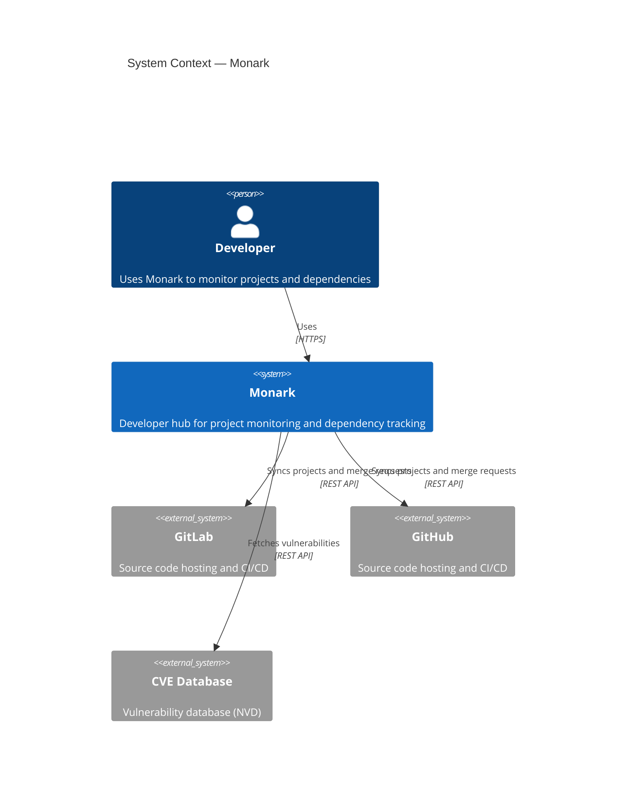

# C4 — System Context

```mermaid
C4Context
    title System Context — Monark

    Person(dev, "Developer", "Uses Monark to monitor projects and dependencies")

    System(monark, "Monark", "Developer hub for project monitoring and dependency tracking")

    System_Ext(gitlab, "GitLab", "Source code hosting and CI/CD")
    System_Ext(github, "GitHub", "Source code hosting and CI/CD")
    System_Ext(cve, "CVE Database", "Vulnerability database (NVD)")

    Rel(dev, monark, "Uses", "HTTPS")
    Rel(monark, gitlab, "Syncs projects and merge requests", "REST API")
    Rel(monark, github, "Syncs projects and merge requests", "REST API")
    Rel(monark, cve, "Fetches vulnerabilities", "REST API")
```
